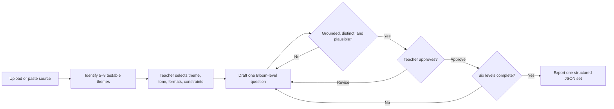

# Bloom’s Quiz Builder — Claude Skill

A source-grounded assessment workflow that helps teachers build and review one question at each of Bloom’s six cognitive levels.

I built this after [BloomGPT](https://chatgpt.com/g/g-qY82hT1eA-bloomgpt) crossed **1,000+ uses**. That signal showed real demand; this skill turns the original prompt experience into a more explicit workflow with teacher choices, per-question checkpoints, answer evidence, and structured output.

[Read the product case study](https://aydoon.com/case-studies/bloom-assessment-workflow) · [View Alex Aidun’s portfolio](https://aydoon.com) · [GitHub profile](https://github.com/bobuel)

## Workflow



The important product decision is the approval loop: the skill does not treat teacher review as cleanup after generation. Review is part of generation.

## What it produces

For each question, the workflow records:

- selected theme and Bloom level
- question type and answer options
- correct answer and rationale
- exact source reference
- comprehension rationale and relative difficulty
- teacher approval before moving to the next level

The completed result is a single JSON object with six approved questions.

## Bloom levels covered

| Level | Cognitive focus |
| --- | --- |
| Remember | Recall facts and basic concepts |
| Understand | Explain ideas or concepts |
| Apply | Use information in a new situation |
| Analyze | Draw connections or break ideas down |
| Evaluate | Justify a decision or course of action |
| Create | Produce new or original work |

## Question formats

- Multiple choice
- Select all that apply
- Finish the sentence
- Matching
- True / false

When a selected format does not fit a cognitive level well—for example, using true/false for Create—the skill flags the mismatch and asks the teacher before changing formats.

## Sample input

The sample source in [`examples/sample-source.md`](examples/sample-source.md) is a short passage about urban trees.

```text
Build an age-appropriate quiz for grade 7.
Theme: how urban trees change neighborhood temperatures.
Formats: multiple choice and select all that apply.
Constraint: every answer must be supported by the supplied passage.
```

## Sample output

[`examples/sample-output.json`](examples/sample-output.json) shows the final structured format across all six levels. One question looks like this:

```json
{
  "bloom_level": "Analyze",
  "question": "Which chain best explains how street trees can lower summer heat risk?",
  "answers": [
    "More shade → cooler surfaces → less heat released into nearby air",
    "More roots → darker pavement → more heat stored overnight",
    "More leaves → less rainfall → lower afternoon humidity",
    "More branches → taller buildings → stronger winter winds"
  ],
  "correct_answer": "More shade → cooler surfaces → less heat released into nearby air",
  "correct_answer_reference": "Paragraph 2",
  "difficulty": "Hard"
}
```

This example is illustrative workflow output, not evidence that the questions have been psychometrically validated.

## Install

1. Download [`bloom-taxonomy-quiz-builder.skill`](bloom-taxonomy-quiz-builder.skill).
2. In Claude, open **Settings → Skills**.
3. Choose **Upload Skill** and select the downloaded file.
4. Start a new conversation, provide educational material, and ask Claude to build a quiz.

Requirements: a Claude account and plan with Skills enabled.

## Repository contents

| Path | Purpose |
| --- | --- |
| `bloom-taxonomy-quiz-builder.skill` | Installable skill archive |
| `SKILL.md` | Human-readable workflow and source of truth |
| `examples/sample-source.md` | Small, reusable input fixture |
| `examples/sample-output.json` | Six-level structured output example |
| `.github/workflows/validate.yml` | Branch/PR checks for the archive and JSON sample |

## Validation and contribution

The branch workflow verifies that the `.skill` archive contains `bloom-quiz-builder/SKILL.md` and that the sample output is valid JSON with six unique Bloom levels.

For instruction changes, edit `SKILL.md`, rebuild the `.skill` archive, and open a pull request with a short example showing the behavioral change.

